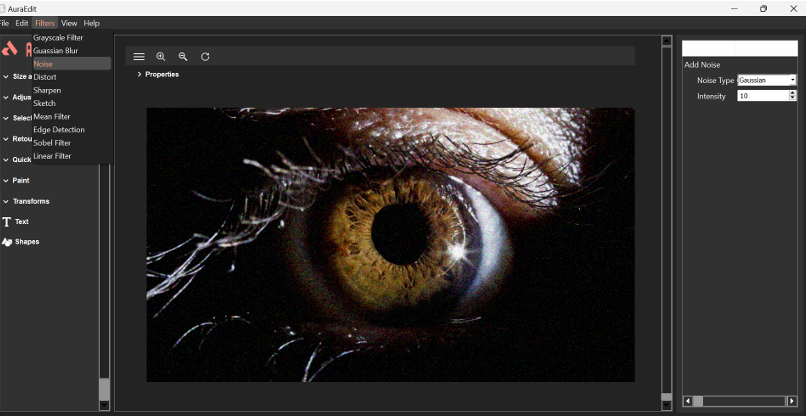
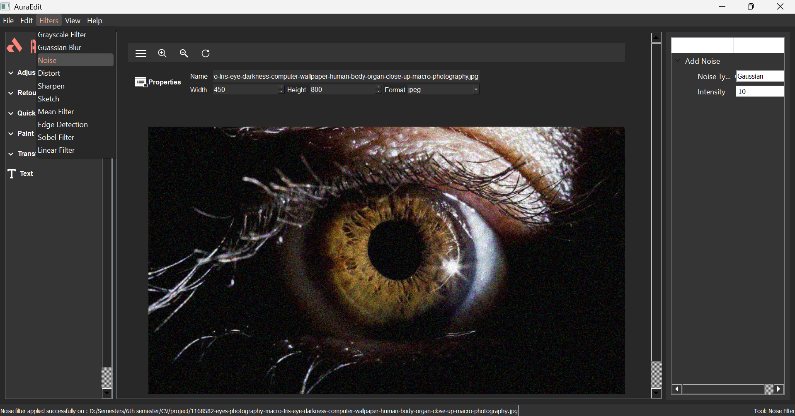

AuraEdit - Computer Vision Image Editor with PyQt5 and Qt Designer

AuraEdit is a desktop image processing application built using **PyQt5** and designed with **Qt Designer**. It leverages powerful computer vision libraries such as **OpenCV**, **Pillow**, and **PyTorch** to provide a variety of image editing and enhancement features through an easy-to-use graphical interface.


## Features

- User-friendly GUI designed using Qt Designer (`mydesign2or.ui`)
- Image loading, viewing, and saving functionalities
- Basic and advanced image processing filters such as Gaussian Blur, Mean, Sharpen, Distorted, Noise, Grayscale, Sobel, Edge Detection, Linear, Sketch etc using OpenCV, 
  Pillow, and SciPy
- Editing Tools such as Zoom in/out, add text, rotate, resize, move/pan images etc.
- Parameter adjustment dialogs for filters
- Supports multiple image formats
- Modular Python code for easy extension and maintenance


## Application GUI

  
*Main application window*

  
*Filter and filter parameter adjustment*


## Installation

### Prerequisites

- Python 3.7 or higher
- [Qt Designer](https://doc.qt.io/qt-5/qtdesigner-manual.html) (for editing `.ui` files)

### Install dependencies

Run the following command to install all required Python packages:

```bash
pip install -r requirements.txt
````


## Usage

1. Clone the repository or download the source files.
2. Ensure all dependencies are installed (see above).
3. Run the main application script:

```bash
python main2.py
```

4. Use the GUI to load images and apply filters.


## Project Structure

```
.
├── main2.py             # Main application entry point
├── convert.py           # Image conversion utilities
├── mydesign2or.py       # Python code generated from Qt Designer UI
├── mydesign2or.ui       # Qt Designer UI file
├── resources.qrc        # Qt resource file (icons, etc.)
├── icon.zip             # Icon assets
├── requirements.txt     # Python dependencies
├── LICENSE              # MIT License file
├── README.md            # This README file
```


## Development

* UI is designed and edited using Qt Designer (`mydesign2or.ui`).
* UI file is converted to Python using `pyuic5`:

```bash
pyuic5 mydesign2or.ui -o mydesign2or.py
```

* Modify `mydesign2or.py` only if needed; preferred approach is to update the `.ui` file and regenerate the Python file.
* Core logic and image processing are handled in `main2.py` and `convert.py`.


## License

This project is licensed under the MIT License. See the [LICENSE](LICENSE) file for details.
